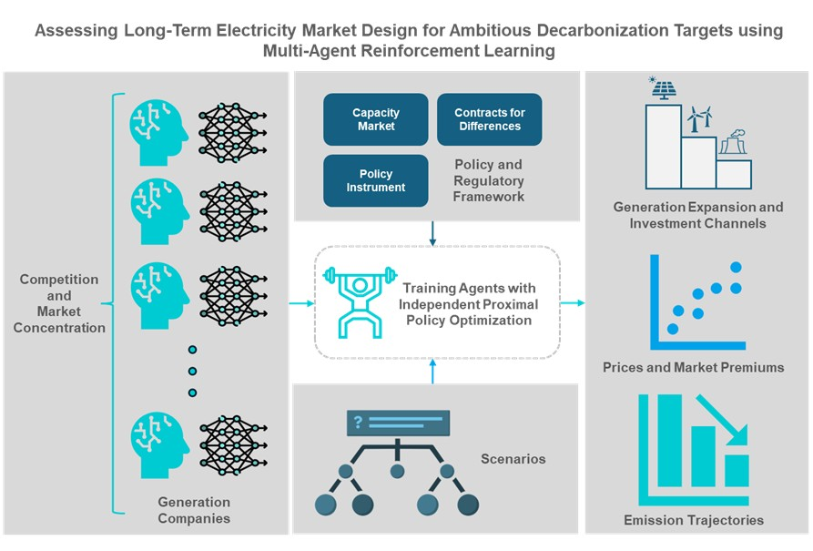

# MARLEY: Multi-Agent Reinforcement Learning for Long-term Electricity Markets

[Javier Gonzalez-Ruiz](https://www.eiee.org/member/javier-jose-gonzalez-ruiz/),[Carlos Rodriguez-Pardo](https://carlosrodriguezpardo.es/),[Alice Di Bella](https://www.eiee.org/member/alice-di-bella/), [Iacopo Savelli](https://green.unibocconi.eu/iacopo-savelli), [Massimo Tavoni](https://www.eiee.org/member/massimo-tavoni/)

## Overview

This repository contains the implementation of a **multi-agent reinforcement learning (MARL) framework** for modeling long-term electricity markets, used in the article "Assessing Long Term Electricity Market Design for Ambitious Decarbonization Targets using Multi-Agent Reinforcement Learning". The model enables the assessment of various market designs, policy instruments, and decarbonization strategies in electricity systems, with a focus on capturing the adaptive behavior of profit-maximizing generation companies making investment decisions.

The framework employs **Independent Proximal Policy Optimization (IPPO)** to simulate decentralized, competitive market environments where multiple agents invest in generation assets through wholesale markets, capacity remuneration mechanisms, and Contract for Differences (CfD) auctions. The framework is based on the Ray and RLLIB MARL implementations, available in https://github.com/ray-project. 



---

## Repository Structure
```
└── CM_CfD.py                # Main RLlib environment implementation
└── training_CM_CfD.py       # Training scripts and configuration
└── data_CM_CfD.py           # Scripts for evaluating trained agents
└── ray_environment.yml      # Conda environment specification
└── README.md                # This file
├── checkpoints/             # Exemplary trained checkpoint (CRM+CfD, 16 agents)
├── excel_scenario_files/    # Base excel files with information for the Italian scenarios studied in the publication
├── images                   # Graphical abstract from the pending publication
├── penalty_environments/    # Alternative environment implementations (with penalty used in section4)
├── utils/                   # Utility scripts for harnessing training data from RLLIB and final results from trained agents, plotting and analysis

```

---

## Installation

### Main Requirements

- Python 3.9
- Conda or Miniconda
- Recommended Linux-based system

### Setup

1. **Clone this repository:**
```bash
   git clone https://github.com/jjgonzalez2491/MARLEY_V1.git
   cd MARLEY_V1
```

2. **Create and activate the conda environment:**
```bash
   conda env create -f ray_environment.yml
   conda activate ray_environment
```

3. **Adjust the corresponding directories**

4. **Modify the training script and the base excel files to set up the simulation**
---

## Usage

### Training

To train agents in the electricity market environment:
```bash
python training_CM_CfD.py
```
To configure the scenario, it is necessary to modify the corresponding variables in the training script and in the corresponding excel file. 

> **Note:** The training script is configured for HPC environments with LSF job scheduling. Modifications may be required for local execution (parallel environments for sampling, maximum GPU memory limits, among others). 

### Evaluation

To evaluate trained agents:
```bash
python data_CM_CfD.py
```
> **Note:** The evaluation script reads a RLLIB checkpoint obtained after training. For testing purposes, an exemplary checkpoint for a system with **16 agents** under **capacity market and CfD mechanisms** is provided in the `checkpoints/` folder.

### Data Files

Base Excel files containing market parameters, technology characteristics, and demand profiles are located in the `excel_scenario_files/` folder. These files define the stylized Italian electricity system used in the paper.

### Visualization

Plotting utilities are provided in the `utils/` folder for generating market outcome visualizations and performance metrics.

---

## Citation

If you use this framework in your research, please cite:
```bibtex
@unpublished{gonzalez-ruiz_assessing_2025,
	title = {Assessing Long-Term Electricity Market Design for Ambitious Decarbonization Targets using Multi Agent Reinforcement Learning},
	author = {Gonzalez-Ruiz, Javier and Rodriguez-Pardo, Carlos and Di Bella, Alice and Tavoni, Massimo},
	date = {2025},
}
```

---

## License

This work is licensed under a [Creative Commons Attribution-ShareAlike 4.0 International License (CC BY-SA 4.0)](https://creativecommons.org/licenses/by-sa/4.0/).

[](https://creativecommons.org/licenses/by-sa/4.0/) 

This license allows reusers to distribute, remix, adapt, and build upon the material in any medium or format, so long as attribution is given to the creator. The license allows for commercial use. If you remix, adapt, or build upon the material, you must license the modified material under identical terms.

---

## Contact

For questions, issues, or contributions, please contact: javier.gonzalez@cmcc.it and/or carlos.rodriguez@cmcc.it. 

---

## Acknowledgments

Authors acknowledge support from the European Union ERC Consolidator Grant under project No. 101044703 (EUNICE), European Union PNRR - Missione 4–Componente 2–Avviso 341 del 15/03/2022 - Next Generation EU, in the framework of the project GRINS - Growing Resilient, INclusive and Sustainable project (GRINS PE00000018 – CUP C83C22000890001), and the European Union’s Horizon Europe programme under the Marie Skłodowska-Curie grant agreement number 101148367. Finally, the framework is based on the Ray and RLLIB libraries, available in https://github.com/ray-project. 
